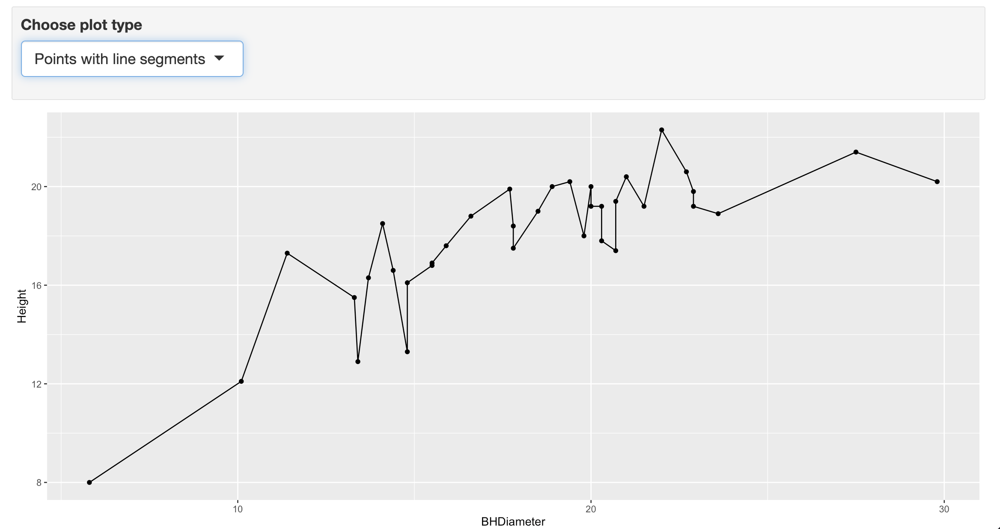
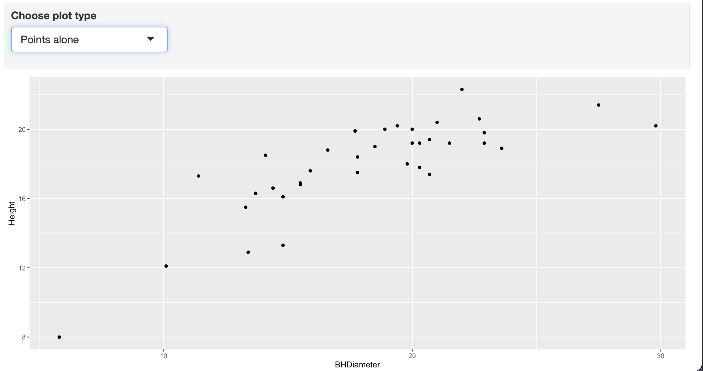
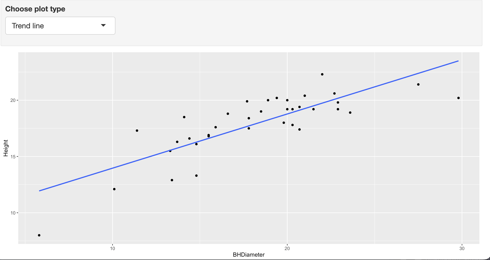

```{r setup, include=FALSE}
knitr::opts_chunk$set(echo = TRUE)
```
# Tasks
## Task 1

WD

```{r}
getwd()
```

## Task 2

```{r}
spruce.df = read.csv("SPRUCE.csv")
head(spruce.df)
```


## Task 3
- Scatter plot of the data.
```{r}
plot(Height ~ BHDiameter, data = spruce.df, main = "Height vs Breast Height Diameter",
     xlab = "Breast Height Diameter (cm)", ylab = "Height (m)",
     pch = 21, bg = "Blue", cex = 1.2,
     xlim = c(0, 1.1 * max(spruce.df$BHDiameter)),
     ylim = c(0, 1.1 * max(spruce.df$Height)))
```


- Does there appear to be a straight line relationship?

There is a clear positive trend, but the points don't sit tightly on one line, Height rises quickly at small diameters and looks like it levels off at the larger ones.


- Lowess smoother scatter plots using trendscatter(), f = 0.5, 0.6, 0.7.
```{r}
library(s20x)
layout(matrix(1:3, nr = 1))
trendscatter(Height ~ BHDiameter, f = 0.5, data = spruce.df, main = "f = 0.5")
trendscatter(Height ~ BHDiameter, f = 0.6, data = spruce.df, main = "f = 0.6")
trendscatter(Height ~ BHDiameter, f = 0.7, data = spruce.df, main = "f = 0.7")
```

- Make the linear model object spruce.lm.
```{r}
spruce.lm = lm(Height ~ BHDiameter, data = spruce.df)
```

- New scatter plot with the least squares regression line added.
```{r}
plot(Height ~ BHDiameter, data = spruce.df, main = "Height vs Diameter with fitted line",
     xlab = "Breast Height Diameter (cm)", ylab = "Height (m)",
     pch = 21, bg = "Blue", cex = 1.2)
abline(spruce.lm)
```

- Comment on the graph, is a straight line appropriate? Consider the smoother curve also.

All three trendscatter curves have the same shape no matter the f value, steep at first, then flattening past about 18cm diameter. The straight line captures the overall trend but sits below the curve at the low and high ends and above it in the middle, so it's a reasonable approximation but not a perfect fit, there's real curvature the line misses.

## Task 4
- The base plot.
```{r}
layout(matrix(1:4, nr = 2, nc = 2, byrow = TRUE))
layout.show(4)
```

- The first, second, third and fourth square plot.
```{r}
yhat = fitted(spruce.lm)
ybar = mean(spruce.df$Height)

layout(matrix(1:4, nr = 2, nc = 2, byrow = TRUE))

plot(Height ~ BHDiameter, data = spruce.df, pch = 21, bg = "Blue",
     ylim = c(0, 1.1 * max(spruce.df$Height)), xlim = c(0, 1.1 * max(spruce.df$BHDiameter)))
abline(spruce.lm)

plot(Height ~ BHDiameter, data = spruce.df, pch = 21, bg = "Blue",
     ylim = c(0, 1.1 * max(spruce.df$Height)), xlim = c(0, 1.1 * max(spruce.df$BHDiameter)))
abline(spruce.lm)
with(spruce.df, segments(BHDiameter, Height, BHDiameter, yhat))

plot(Height ~ BHDiameter, data = spruce.df, pch = 21, bg = "Blue",
     ylim = c(0, 1.1 * max(spruce.df$Height)), xlim = c(0, 1.1 * max(spruce.df$BHDiameter)))
abline(spruce.lm)
abline(h = ybar)
with(spruce.df, segments(BHDiameter, ybar, BHDiameter, yhat, col = "Red"))

plot(Height ~ BHDiameter, data = spruce.df, pch = 21, bg = "Blue",
     ylim = c(0, 1.1 * max(spruce.df$Height)), xlim = c(0, 1.1 * max(spruce.df$BHDiameter)))
abline(h = ybar)
with(spruce.df, segments(BHDiameter, Height, BHDiameter, ybar, col = "Green"))
```

- Calculate TSS, MSS and RSS.
```{r}
RSS = sum((spruce.df$Height - yhat) ^ 2)
MSS = sum((yhat - ybar) ^ 2)
TSS = sum((spruce.df$Height - ybar) ^ 2)
RSS
MSS
TSS
```
RSS = 95.70, MSS = 183.24, TSS = 278.95.

- Calculate MSS/TSS, and interpret it.
```{r}
MSS / TSS
```
MSS/TSS = 0.6569. This means about 65.7% of the variation in Height is explained by the linear relationship with BHDiameter, the remaining 34.3% is left over as unexplained residual variation.

- Does TSS = MSS + RSS?
```{r}
TSS
MSS + RSS
```
Yes, TSS = 278.9475 and MSS + RSS = 278.9475, they match.

## Task 5
- Summarize spruce.lm.
```{r}
summary(spruce.lm)
```

- What is the value of the slope and intercept?
```{r}
coef(spruce.lm)
```

- The equation of the fitted line.
Height = 9.1468 + 0.4815 × BHDiameter

- Predict the Height of spruce.
```{r}
predict(spruce.lm, data.frame(BHDiameter = c(15, 18, 20)))
```
At 15cm: 16.37m, at 18cm: 17.81m, at 20cm: 18.78m.

## Task 6
- ggplot of Height vs Diameter with shading and legend.
```{r, warning=FALSE}
library(ggplot2)
g = ggplot(spruce.df, aes(x = BHDiameter, y = Height, colour = BHDiameter))
g = g + geom_point() + geom_line() + geom_smooth(method = "lm")
g + ggtitle("Height Vs Diameter")

```


## Task 7
<center>

- Trend line:

{ width=70% }

- Points line:

{ width=70% }

- Line: 

{ width=70% }
</center>

## Task 8: AI

I used AI (Claude) to help build one new R function, ssDecomp(), that generalizes the four panel sum of squares decomposition from Task 4.

- How is it better?

Task 4 required four nearly identical hand written plotting blocks (fitted line, residual segments, model deviation segments, total deviation segments) plus three separate lines to compute RSS, MSS, and TSS, all hardcoded to spruce.df, Height, and BHDiameter specifically. ssDecomp() generalizes that entire pattern into a single reusable function call that works on any data frame and any one predictor formula. It fits the model, draws all four panels in one layout() call, prints a numeric check that TSS = MSS + RSS, and returns the fitted model plus RSS, MSS, TSS, and R squared so the numbers can be reused instead of retyped. It ships with a documented spruce.df dataset built into the package and a testthat unit test checking TSS = MSS + RSS, and it passes R CMD check with 0 errors, 0 warnings, 0 notes.

- Install and check

I built the package MATH4753LucNguyenF26, installed it, and ran R CMD check. Last lines of the check:

✔  checking Rd \usage sections ...
✔  checking Rd contents ...
✔  checking for unstated dependencies in examples ...
✔  checking contents of ‘data’ directory
✔  checking data for non-ASCII characters ...
✔  checking LazyData
✔  checking data for ASCII and uncompressed saves ...
✔  checking examples (372ms)
✔  checking for unstated dependencies in ‘tests’ ...
─  checking tests ...
✔  Running ‘testthat.R’
✔  checking for non-standard things in the check directory
✔  checking for detritus in the temp directory
   
   
── R CMD check results ────────────────────────── MATH4753LucNguyenF26 0.0.0.9000 ────
Duration: 6.3s

0 errors ✔ | 0 warnings ✔ | 0 notes ✔

- Invoke the function
```{r}
MATH4753LucNguyenF26::ssDecomp(data = spruce.df, formula = Height ~ BHDiameter)
```
- Body of the function
```{r}
ssDecomp <- function(data, formula, col_mss = "Red", col_tss = "Green", pt_bg = "Blue") {
  # fit the model here so the caller only has to pass data + formula,
  # matching the data = ..., etc call style used throughout this lab
  model <- lm(formula, data = data)

  # pull the response and the single predictor straight out of the model
  mf <- model.frame(model)
  y <- mf[[1]]
  x <- mf[[2]]
  xname <- names(mf)[2]
  yname <- names(mf)[1]

  yhat <- fitted(model)
  ybar <- mean(y)

  # the three sums of squares and R squared, computed once and reused
  # across all four panels instead of recomputed per plot
  RSS <- sum((y - yhat) ^ 2)
  MSS <- sum((yhat - ybar) ^ 2)
  TSS <- sum((y - ybar) ^ 2)
  Rsquared <- MSS / TSS

  # restore the caller's plotting parameters when this function exits
  op <- par(no.readonly = TRUE)
  on.exit(par(op))
  layout(matrix(1:4, nrow = 2, ncol = 2, byrow = TRUE))

  ylim <- c(0, 1.1 * max(y))
  xlim <- c(0, 1.1 * max(x))

  # panel 1: scatter plot with the fitted least squares line
  plot(x, y, pch = 21, bg = pt_bg, xlab = xname, ylab = yname,
       xlim = xlim, ylim = ylim, main = "Fitted line")
  abline(model)

  # panel 2: residual deviations, y minus yhat (RSS)
  plot(x, y, pch = 21, bg = pt_bg, xlab = xname, ylab = yname,
       xlim = xlim, ylim = ylim, main = "RSS")
  abline(model)
  segments(x, y, x, yhat)

  # panel 3: model deviations, yhat minus ybar (MSS)
  plot(x, y, pch = 21, bg = pt_bg, xlab = xname, ylab = yname,
       xlim = xlim, ylim = ylim, main = "MSS")
  abline(model)
  abline(h = ybar)
  segments(x, ybar, x, yhat, col = col_mss)

  # panel 4: total deviations, y minus ybar (TSS)
  plot(x, y, pch = 21, bg = pt_bg, xlab = xname, ylab = yname,
       xlim = xlim, ylim = ylim, main = "TSS")
  abline(h = ybar)
  segments(x, y, x, ybar, col = col_tss)

  # print a quick numeric check that TSS = MSS + RSS
  cat(sprintf(
    "RSS = %.4f\nMSS = %.4f\nTSS = %.4f\nR-squared (MSS/TSS) = %.4f\nTSS - (MSS + RSS) = %.6f\n",
    RSS, MSS, TSS, Rsquared, TSS - (MSS + RSS)
  ))

  invisible(list(model = model, RSS = RSS, MSS = MSS, TSS = TSS, Rsquared = Rsquared))
}
```

- Interpret the output

The function prints RSS = 95.70, MSS = 183.24, TSS = 278.95, R squared = 0.6569, and TSS minus (MSS + RSS) essentially zero, exactly matching what was calculated by hand in Task 4. It produces "better" measures because it is not tied to one dataset, the same call works on any lm-style problem with one predictor, and it returns the numbers as a list instead of leaving them scattered across separate print statements, so they can be reused directly (for example in a table) rather than retyped.
