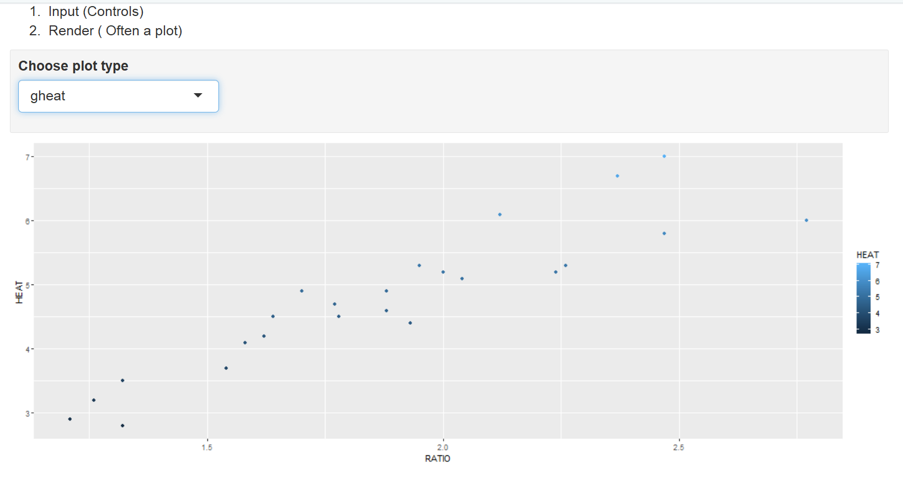

```{r setup, include=FALSE}
knitr::opts_chunk$set(echo = TRUE)
```
# Tasks
## Task 1

WD

```{r}
getwd()
```

## Task 2

```{r}
spruce.df = read.csv("SPRUCE.csv")
head(spruce.df)
```


## Task 3
- Scatter plot of the data.
```{r}
plot(Height ~ BHDiameter, data = spruce.df, main = "Height vs Breast Height Diameter",
     xlab = "Breast Height Diameter (cm)", ylab = "Height (m)",
     pch = 21, bg = "Blue", cex = 1.2,
     xlim = c(0, 1.1 * max(spruce.df$BHDiameter)),
     ylim = c(0, 1.1 * max(spruce.df$Height)))
```


- Does there appear to be a straight line relationship?

There is a clear positive trend, but the points don't sit tightly on one line, Height rises quickly at small diameters and looks like it levels off at the larger ones.


- Lowess smoother scatter plots using trendscatter(), f = 0.5, 0.6, 0.7.
```{r}
library(s20x)
layout(matrix(1:3, nr = 1))
trendscatter(Height ~ BHDiameter, f = 0.5, data = spruce.df, main = "f = 0.5")
trendscatter(Height ~ BHDiameter, f = 0.6, data = spruce.df, main = "f = 0.6")
trendscatter(Height ~ BHDiameter, f = 0.7, data = spruce.df, main = "f = 0.7")
```

- Make the linear model object spruce.lm.
```{r}
spruce.lm = lm(Height ~ BHDiameter, data = spruce.df)
```

- New scatter plot with the least squares regression line added.
```{r}
plot(Height ~ BHDiameter, data = spruce.df, main = "Height vs Diameter with fitted line",
     xlab = "Breast Height Diameter (cm)", ylab = "Height (m)",
     pch = 21, bg = "Blue", cex = 1.2)
abline(spruce.lm)
```

- Comment on the graph, is a straight line appropriate? Consider the smoother curve also.

All three trendscatter curves have the same shape no matter the f value, steep at first, then flattening past about 18cm diameter. The straight line captures the overall trend but sits below the curve at the low and high ends and above it in the middle, so it's a reasonable approximation but not a perfect fit, there's real curvature the line misses.

## Task 4
- The base plot.
```{r}
layout(matrix(1:4, nr = 2, nc = 2, byrow = TRUE))
layout.show(4)
```

- The first, second, third and fourth square plot.
```{r}
yhat = fitted(spruce.lm)
ybar = mean(spruce.df$Height)

layout(matrix(1:4, nr = 2, nc = 2, byrow = TRUE))

plot(Height ~ BHDiameter, data = spruce.df, pch = 21, bg = "Blue",
     ylim = c(0, 1.1 * max(spruce.df$Height)), xlim = c(0, 1.1 * max(spruce.df$BHDiameter)))
abline(spruce.lm)

plot(Height ~ BHDiameter, data = spruce.df, pch = 21, bg = "Blue",
     ylim = c(0, 1.1 * max(spruce.df$Height)), xlim = c(0, 1.1 * max(spruce.df$BHDiameter)))
abline(spruce.lm)
with(spruce.df, segments(BHDiameter, Height, BHDiameter, yhat))

plot(Height ~ BHDiameter, data = spruce.df, pch = 21, bg = "Blue",
     ylim = c(0, 1.1 * max(spruce.df$Height)), xlim = c(0, 1.1 * max(spruce.df$BHDiameter)))
abline(spruce.lm)
abline(h = ybar)
with(spruce.df, segments(BHDiameter, ybar, BHDiameter, yhat, col = "Red"))

plot(Height ~ BHDiameter, data = spruce.df, pch = 21, bg = "Blue",
     ylim = c(0, 1.1 * max(spruce.df$Height)), xlim = c(0, 1.1 * max(spruce.df$BHDiameter)))
abline(h = ybar)
with(spruce.df, segments(BHDiameter, Height, BHDiameter, ybar, col = "Green"))
```

- Calculate TSS, MSS and RSS.
```{r}
RSS = sum((spruce.df$Height - yhat) ^ 2)
MSS = sum((yhat - ybar) ^ 2)
TSS = sum((spruce.df$Height - ybar) ^ 2)
RSS
MSS
TSS
```
RSS = 95.70, MSS = 183.24, TSS = 278.95.

- Calculate MSS/TSS, and interpret it.
```{r}
MSS / TSS
```
MSS/TSS = 0.6569. This means about 65.7% of the variation in Height is explained by the linear relationship with BHDiameter, the remaining 34.3% is left over as unexplained residual variation.

- Does TSS = MSS + RSS?
```{r}
TSS
MSS + RSS
```
Yes, TSS = 278.9475 and MSS + RSS = 278.9475, they match.

## Task 5
- Summarize spruce.lm.
```{r}
summary(spruce.lm)
```

- What is the value of the slope and intercept?
```{r}
coef(spruce.lm)
```

- The equation of the fitted line.
Height = 9.1468 + 0.4815 × BHDiameter

- Predict the Height of spruce.
```{r}
predict(spruce.lm, data.frame(BHDiameter = c(15, 18, 20)))
```
At 15cm: 16.37m, at 18cm: 17.81m, at 20cm: 18.78m.

## Task 6


## Task 7
This is how you place images in RMD documents

<center>
{ width=70% }
</center>


